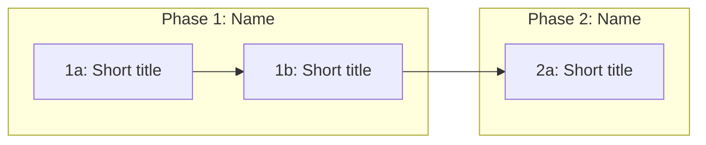

# /attack-plan - Break Spec into Autonomous-Runnable Waves

Transform a spec or plan into a phased attack plan with GitHub issues, dependency graph, parallelism analysis, and `/run-autonomous` execution commands. Produces the plan only — does NOT launch autonomous runs.

## Usage

```
/attack-plan <spec-path-or-name>
```

## Arguments

- `$ARGUMENTS` — path to a spec file, name fragment (matched against `docs/plans/`), or a GitHub issue/milestone reference

## Examples

```bash
/attack-plan docs/plans/v0.3.0-spiral-1-foundation.md
/attack-plan spiral-1
/attack-plan #42
```

## Workflow

### 1. Resolve Spec

**If path or name fragment**:
```bash
# Exact path
cat docs/plans/$ARGUMENTS 2>/dev/null

# Name fragment search
find docs/plans/ -name "*$ARGUMENTS*" -type f
```

**If issue number**: Fetch issue body, check for linked spec file references.

**If no argument**: List available plans and ask which to use.

Read the resolved spec file completely. Also read:
- Project CLAUDE.md (for autonomous-ready criteria, branch conventions, test commands)
- Any linked detail specs referenced in the plan (e.g., `docs/ai/*.md`, `docs/architecture/*.md`)

### 2. Analyze the Spec

Extract from the spec:
- **Requirements**: Must-have items, acceptance criteria
- **Design decisions**: Approach, key decisions table, files to create/modify
- **Build order**: Existing step sequence (if any)
- **Test strategy**: What validation each step needs

If the spec already has a Build Order section with steps, use it as the skeleton. Otherwise, derive phases from the requirements and file dependencies.

### 3. Codebase Audit

Before breaking into issues, verify the spec against current code state:

```bash
# Check files mentioned in the spec actually exist (or confirm they're new)
# Verify imports, interfaces, and dependencies the spec assumes
# Look for recent changes that might affect the plan
```

Flag any discrepancies between spec assumptions and current codebase. Present corrections as a table (like the "Scope Corrections" pattern in existing plans).

### 4. Break into Phases and Steps

Group steps into phases based on dependency and domain boundaries.

Each step becomes a table row:

```markdown
| Step | Issue | Description | Type | Max Turns |
|------|-------|-------------|------|-----------|
| 1a | TBD | **Bold title** — Detailed description referencing spec sections. Specific files, specific behavior. | feature/refactor/fix/test/script/chore | N |
```

**Step description requirements** (must meet project's autonomous-ready criteria):
- Concrete behavior (Given/Does/System does), not abstract
- At least 2 edge cases with specific input→behavior pairs
- Acceptance criteria as checkboxes (independently verifiable)
- Specific file paths in "Files Likely Affected"
- Single responsibility — one concern per step
- Reference the relevant spec section with a relative link

**Max Turns estimation**:
- Simple additive (new file, no dependencies): 10-15
- Moderate (modify existing + tests): 15-20
- Complex (multi-file refactor, cross-cutting): 20-25
- Large (new surface area + integration): 25-30

### 5. Build Order Diagram

Generate a mermaid dependency graph:

```markdown

```

### 6. Parallelism Analysis

Group steps into waves — sets that can run concurrently:

```markdown
| Wave | Steps | Rationale |
|------|-------|-----------|
| 1 | 1a, 2a, 3a | All additive or touch disjoint files |
| 2 | 1b, 2b | Depend on wave 1 results |
```

### 7. Conflict Risk Assessment

Identify shared files across steps:

```markdown
| Risk | Steps | Mitigation |
|------|-------|------------|
| schemas/__init__.py | 1a, 2b | Sequential within stream |
| types/index.ts | 1a, 3a | Low — different sections |
```

Rate overall risk: **Low** (disjoint files), **Medium** (some overlap, manageable), **High** (significant overlap, needs careful ordering).

### 8. Execution Commands

Generate the actual `/run-autonomous` invocations per wave:

```markdown
### Wave 1 (N parallel)

```bash
/run-autonomous <issue-numbers> --max-turns N --base <branch>
```

### Wave 2 (after Wave 1 merges)

```bash
/run-autonomous <issue-numbers> --max-turns N --base <branch>
```
```

Use issue numbers when available, TBD when issues haven't been created yet.

### 9. Completion Criteria

Numbered list of verifiable assertions. Each criterion must be testable without human judgment:

```markdown
## Completion Criteria

1. `bash scripts/pre-push.sh` passes on <base-branch> after all merges
2. <specific endpoint> returns <specific shape>
3. <specific component> renders at <specific route>
```

### 10. Present and Iterate

Present the full attack plan to the user. Include a **Decision Summary** per the learning protocol:

```markdown
**Decisions in this attack plan:**
1. [Decision] — [trade-off / why it matters]
2. [Decision] — [trade-off / why it matters]
```

Iterate on feedback. When approved:
- Write/update the plan file in `docs/plans/` (append or replace the Phases/Build Order/Execution sections)
- Optionally create GitHub issues per step (only if user confirms)
- Optionally create a GitHub milestone (only if user confirms)

## Output Location

The attack plan is written into the spec file itself (updating/adding Phases, Build Order, Parallelism, Execution, and Completion Criteria sections). This keeps spec + plan as a single living document.

If the user prefers a separate file, write to `docs/plans/<name>-attack-plan.md` and cross-reference from the spec.

## Integration with Other Commands

```
/prd → produces spec (requirements, design, build order skeleton)
  ↓
/attack-plan → transforms spec into phased, autonomous-runnable plan
  ↓
/run-autonomous → executes waves from the attack plan
  ↓
/next <milestone> → resumes work, triggers next wave, triages PRs
  ↓
/predict → prediction exam while autonomous runs execute
```

## Design Principles

- **Spec fidelity**: The attack plan implements the spec — it doesn't redesign it. Flag spec gaps, don't silently resolve them.
- **Autonomous-ready by default**: Every step description must meet the project's autonomous-ready criteria. If a step can't meet them, flag it as manual.
- **Conservative turn estimates**: Overestimate rather than underestimate. An agent that finishes early is better than one that runs out of turns.
- **Dependency-first ordering**: Steps with downstream dependents go in earlier waves.
- **Conflict minimization**: Prefer more waves with less parallelism over fewer waves with merge conflicts.

## Anti-Patterns

- Don't create steps that mix concerns (e.g., "add API endpoint and update frontend") — single responsibility
- Don't assume files exist without checking — run the codebase audit
- Don't create issues without user confirmation
- Don't launch autonomous runs — this command only produces the plan
- Don't skip the conflict risk assessment — merge conflicts waste more time than an extra wave
- Don't write vague descriptions ("refactor the thing") — every step needs specific files and behaviors
