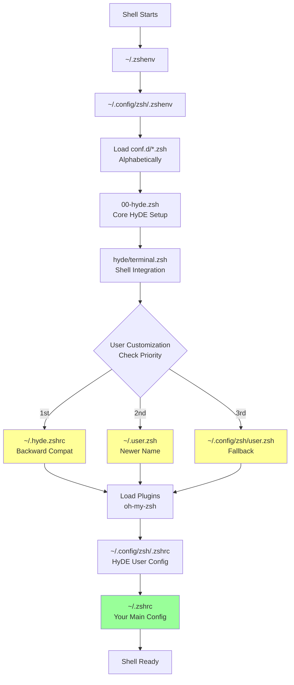
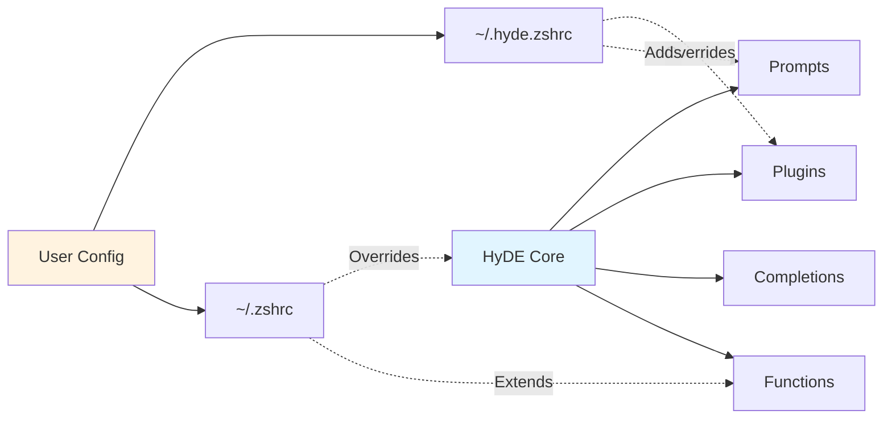
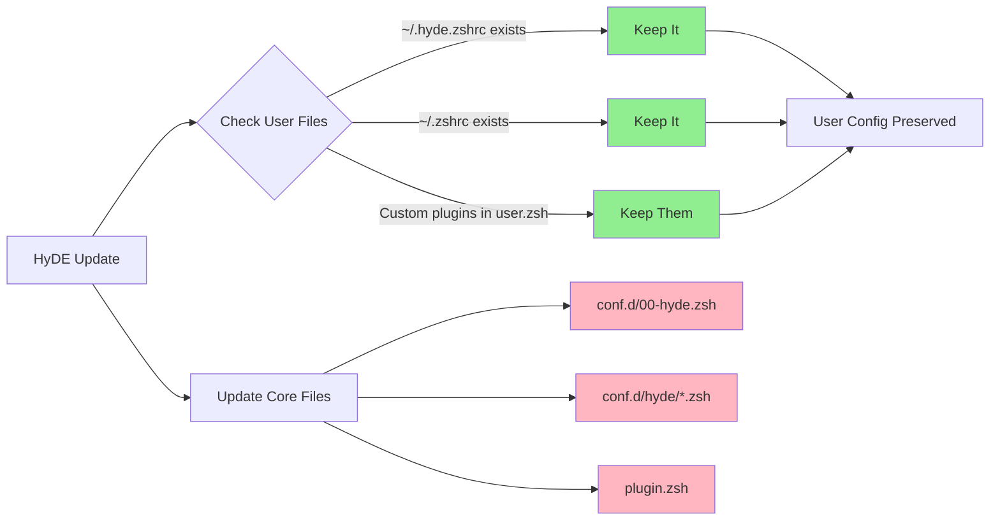

# HyDE (HyprDE) Configuration Guide

**HyDE** (HyprDE) is a desktop environment framework for Hyprland that provides centralized configuration management for theming, shell setup, and system tools.

**Related Documentation:**
- [Zsh Configuration](./zsh.md) - Shell configuration and customization
- [Shell Directory](../shell/README.md) - Versioned shell configs

---

## Table of Contents

- [Overview](#overview)
- [Architecture](#architecture)
- [Directory Structure](#directory-structure)
- [Configuration Files](#configuration-files)
- [Customization Points](#customization-points)
- [Update Safety](#update-safety)

---

## Overview

### What is HyDE?

HyDE is a complete desktop environment built on top of Hyprland that manages:
- **Shell configuration** (zsh with oh-my-zsh)
- **Terminal theming** (prompts, colors, plugins)
- **Desktop theming** (waybar, hyprland, system-wide themes)
- **System utilities** (package management, keybindings)

### Design Philosophy

HyDE uses a **non-invasive update strategy**:
- Core HyDE files can be updated without breaking user configs
- User customizations are stored in separate files
- Clear separation between managed and user-owned files

### Key Locations

```
~/.config/zsh/           # HyDE-managed zsh configuration
~/.hyde.zshrc            # User customization hook (backward compat)
~/.user.zsh              # User customization hook (newer name)
~/.zshrc                 # User's main shell config
```

---

## Architecture

### Loading Flow



### Component Interaction



---

## Directory Structure

### HyDE Configuration Tree

```
~/.config/zsh/
├── .zshenv                  # Environment setup, loads conf.d/
├── .zshrc                   # HyDE user config (sources ~/.zshrc)
├── .zsh_history             # Command history
├── .p10k.zsh                # Powerlevel10k theme config
├── conf.d/                  # Modular configuration
│   ├── 00-hyde.zsh         # Core HyDE setup (loads first)
│   └── hyde/
│       ├── env.zsh         # Environment variables
│       └── terminal.zsh    # Terminal integration, user hooks
├── completions/            # Custom completions
│   └── *.zsh
├── functions/              # Shell functions
│   └── *.zsh
├── plugin.zsh              # Plugin loading system
├── prompt.zsh              # Prompt configuration
└── user.zsh                # User startup config (plugins, art)
```

### User Customization Files

```
~/
├── .zshenv                  # Redirects to ~/.config/zsh/
├── .hyde.zshrc             # YOUR: HyDE customizations (old name)
├── .user.zsh               # YOUR: HyDE customizations (new name)
├── .zshrc                  # YOUR: Main shell config
└── .zshrc.secrets          # YOUR: API keys, tokens (unversioned)
```

---

## Configuration Files

### Core HyDE Files (DO NOT EDIT)

| File | Purpose | Update Safe? |
|------|---------|--------------|
| `~/.config/zsh/.zshenv` | Loads modular configs from conf.d/ | ❌ Managed by HyDE |
| `~/.config/zsh/conf.d/00-hyde.zsh` | Core HyDE initialization | ❌ Managed by HyDE |
| `~/.config/zsh/conf.d/hyde/terminal.zsh` | Terminal setup, user hooks | ❌ Managed by HyDE |
| `~/.config/zsh/plugin.zsh` | Plugin loader | ❌ Managed by HyDE |
| `~/.config/zsh/prompt.zsh` | Prompt configuration | ❌ Managed by HyDE |

### User Files (SAFE TO EDIT)

| File | Purpose | When to Use | Priority |
|------|---------|-------------|----------|
| `~/.hyde.zshrc` | HyDE-specific customizations | Override HyDE defaults, plugins | 🥇 Highest |
| `~/.user.zsh` | Same as .hyde.zshrc (newer name) | Modern alternative to .hyde.zshrc | 🥈 Second |
| `~/.config/zsh/user.zsh` | Fallback user config | If neither above exists | 🥉 Third |
| `~/.zshrc` | Main shell configuration | PATH, aliases, tools, sourcing | ✅ Final |
| `~/.zshrc.secrets` | Secrets only | API keys, tokens | ✅ Sourced from .zshrc |

**Recommendation:** Use `~/.hyde.zshrc` for HyDE customizations and `~/.zshrc` for general shell config.

---

## Customization Points

### 1. Startup Commands (~/.hyde.zshrc or user.zsh)

Control what displays when terminal opens:

```bash
# ~/.hyde.zshrc

#  Startup
if [[ $- == *i* ]]; then
    # Display a random Pokémon
    if command -v pokego >/dev/null; then
        pokego --no-title -r 1,3,6
    fi

    # Or display system info
    # if command -v fastfetch >/dev/null; then
    #     fastfetch --logo-type kitty
    # fi
fi
```

### 2. HyDE Behavior Overrides (~/.hyde.zshrc)

Disable or customize HyDE features:

```bash
# ~/.hyde.zshrc

# Disable HyDE's plugin system (use your own)
# HYDE_ZSH_NO_PLUGINS=1

# Disable HyDE's prompt (use your own)
# unset HYDE_ZSH_PROMPT

# Change compinit check frequency (hours)
# HYDE_ZSH_COMPINIT_CHECK=24  # Default: 1 hour

# Disable deferred plugin loading
# HYDE_ZSH_DEFER=0
```

### 3. oh-my-zsh Plugins (~/.hyde.zshrc or user.zsh)

Add or override plugins:

```bash
# ~/.hyde.zshrc

if [[ ${HYDE_ZSH_NO_PLUGINS} != "1" ]]; then
    plugins=(
        "sudo"              # HyDE default
        "git"               # Add git plugin
        "docker"            # Add docker completions
        "kubectl"           # Add kubectl completions
    )
fi
```

**Note:** HyDE automatically adds these plugins: `git`, `zsh-256color`, `zsh-autosuggestions`, `zsh-syntax-highlighting`

### 4. Aliases Override

**In ~/.hyde.zshrc** - Override HyDE defaults:

```bash
# ~/.hyde.zshrc

# Override HyDE's 'c' alias
alias c='clear && echo "Terminal cleared"'
```

**In ~/.zshrc** - Add new aliases (loaded after HyDE):

```bash
# ~/.zshrc

# Your custom aliases
alias hyprdots='cd /home/warley/life/2-areas/dev-tools/hyprdots'
alias ll='ls -lah'
```

See [zsh.md](./zsh.md#aliases) for more alias examples.

### 5. Environment Variables

**HyDE-managed** (`~/.config/zsh/conf.d/hyde/env.zsh`):
- Do not edit directly (will be overwritten)
- Override in `~/.zshrc` if needed

**User-managed** (`~/.zshrc`):
- PATH modifications
- Tool configurations
- See [zsh.md](./zsh.md#environment-variables) for examples

**Secrets** (`~/.zshrc.secrets`):
- API keys, tokens
- Never version controlled
- See [shell/README.md](../shell/README.md#secret-management)

---

## Update Safety

### What Gets Updated

When HyDE updates, these files may be overwritten:

```
~/.config/zsh/.zshenv
~/.config/zsh/.zshrc
~/.config/zsh/conf.d/00-hyde.zsh
~/.config/zsh/conf.d/hyde/*.zsh
~/.config/zsh/plugin.zsh
~/.config/zsh/prompt.zsh
~/.config/zsh/.p10k.zsh
```

### What Stays Safe

Your customizations in these files are **never touched** by HyDE updates:

```
~/.hyde.zshrc              ✅ Your HyDE customizations
~/.user.zsh                ✅ Alternative to .hyde.zshrc
~/.zshrc                   ✅ Your main shell config
~/.zshrc.secrets           ✅ Your secrets
~/.config/zsh/user.zsh     ✅ Fallback user config
```

### Update Strategy



### Best Practices

1. **Never edit files in `~/.config/zsh/conf.d/hyde/`**
   - These are HyDE-managed and will be overwritten

2. **Use the user hooks**
   - `~/.hyde.zshrc` for HyDE-specific customizations
   - `~/.zshrc` for general shell config

3. **Version your user configs**
   - See [shell/README.md](../shell/README.md) for symlink setup
   - Keep secrets in `~/.zshrc.secrets` (unversioned)

4. **Test after updates**
   ```bash
   # After HyDE update, reload shell
   source ~/.zshrc

   # Verify your customizations still work
   alias  # Check your aliases
   echo $PATH  # Check your PATH
   ```

---

## Troubleshooting

### Plugins Not Loading

**Problem:** Custom plugins not appearing

**Solution:** Check plugin loading in `~/.hyde.zshrc`:

```bash
# ~/.hyde.zshrc
if [[ ${HYDE_ZSH_NO_PLUGINS} != "1" ]]; then
    plugins=(
        "sudo"
        "your-plugin-here"  # Add your plugin
    )
fi
```

### Slow Shell Startup

**Problem:** Terminal takes too long to open

**Solution:** Enable deferred loading (default in HyDE):

```bash
# ~/.hyde.zshrc
HYDE_ZSH_DEFER=1  # Ensure this is set (default)
```

### Custom Prompt Not Working

**Problem:** Prompt reverts to HyDE default

**Solution:** Disable HyDE prompt in `~/.hyde.zshrc`:

```bash
# ~/.hyde.zshrc
unset HYDE_ZSH_PROMPT
```

Then load your custom prompt in `~/.zshrc`.

### Environment Variables Not Set

**Problem:** Variables defined in `~/.zshrc` not available

**Solution:** Ensure `~/.zshrc` is being sourced:

```bash
# Check if sourced
grep "source ~/.zshrc" ~/.config/zsh/.zshrc

# Should output:
# source ~/.zshrc
```

---

## Advanced Configuration

### Custom Plugin System

Disable HyDE's plugin system and use your own:

```bash
# ~/.hyde.zshrc
HYDE_ZSH_NO_PLUGINS=1
```

```bash
# ~/.zshrc
# Load your plugin manager (zinit, zplug, etc.)
source ~/.zsh/zinit/zinit.zsh
zinit load zsh-users/zsh-autosuggestions
zinit load zsh-users/zsh-syntax-highlighting
```

### Custom Prompt Framework

Use starship, oh-my-posh, or other prompt:

```bash
# ~/.hyde.zshrc
unset HYDE_ZSH_PROMPT
```

```bash
# ~/.zshrc
# Initialize starship
eval "$(starship init zsh)"
```

### Performance Optimization

Reduce startup time by deferring expensive operations:

```bash
# ~/.zshrc
# Defer nvm initialization
lazy_load_nvm() {
    unset -f node npm nvm
    source /usr/share/nvm/init-nvm.sh
}
alias node='lazy_load_nvm; node'
alias npm='lazy_load_nvm; npm'
alias nvm='lazy_load_nvm; nvm'
```

---

## References

- **HyDE Project:** [GitHub - HyprDE](https://github.com/prasanthrangan/hyprdots)
- **Zsh Documentation:** [zsh.sourceforge.io](https://zsh.sourceforge.io/)
- **oh-my-zsh:** [ohmyz.sh](https://ohmyz.sh/)
- **Related Docs:**
  - [Zsh Configuration Guide](./zsh.md)
  - [Shell Directory Setup](../shell/README.md)
